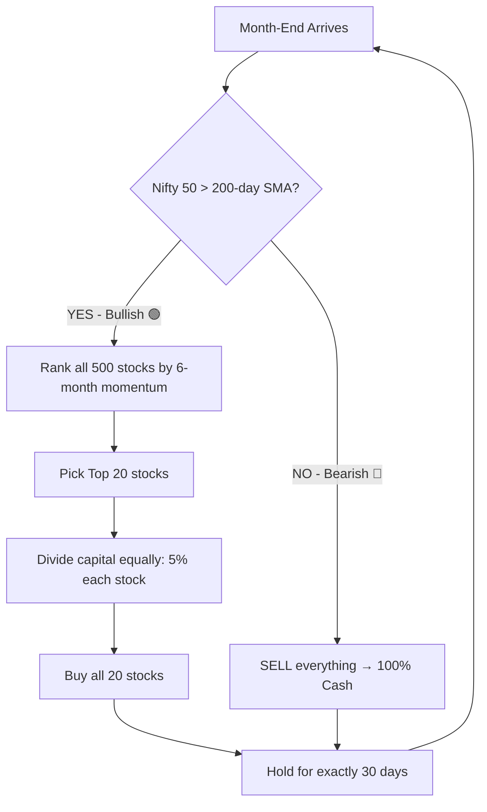

# 🚀 Monthly Momentum Strategy — Complete Walkthrough

## What Is This Strategy?

A **monthly momentum** strategy that picks the **Top 20 fastest-rising stocks** from the Nifty 500 universe, holds them for exactly 30 days, then repeats. A **Nifty 50 regime filter** protects capital during market crashes by moving to 100% cash.

- **Backtest Period**: 2015 – 2026 (10+ years)
- **CAGR**: **29.81%**
- **Max Drawdown**: -32.62%
- **Starting Capital**: ₹10,00,000 → **₹1,74,16,390**

---

## 🎬 How Money Flows — Step by Step

### Starting Point
You have **₹10,00,000** in your bank account.

### 📅 Last Trading Day of Month (e.g., January 31st)

The code checks one critical question:

> **"Is the Nifty 50 Index above its 200-day Simple Moving Average?"**



### If Bullish (Nifty 50 > 200 SMA):
1. Code ranks all 500 stocks by their **6-month return**
2. Applies filters: stock must be above its own 200 SMA, price > ₹10, daily turnover > ₹5 Cr
3. Picks the **Top 20 winners**
4. You divide your capital into 20 equal parts (₹50,000 each if starting with ₹10L)
5. **Buy all 20 stocks** at market close
6. Your bank account = ₹0. Money is now inside 20 stocks.

### If Bearish (Nifty 50 < 200 SMA):
1. **SELL EVERYTHING** immediately
2. All money returns to cash
3. You hold **zero stocks** and sleep peacefully

---

## 🔄 What Happens at the NEXT Month-End?

### Scenario A: Market stays Bullish
The code recalculates the Top 20 rankings. Three things can happen to each stock:

| Stock Status | Action | Example |
|---|---|---|
| **Still in Top 20** | Do nothing, keep holding | 14 stocks unchanged |
| **Dropped out of Top 20** | SELL it | 6 stocks sold |
| **New entry into Top 20** | BUY it | 6 new stocks bought |

> This rotation is called **"Turnover"** — typically 10-14 stocks change per month.

### Scenario B: Market turned Bearish
- **SELL ALL 20 stocks** at today's closing price
- Whatever money comes back (profit or loss) goes to cash
- Wait until the market recovers above 200 SMA

### Scenario C: Was in Cash, Market recovered
- Market was bearish last month, so you were in cash
- Now Nifty 50 is back above 200 SMA
- **BUY the fresh Top 20 stocks** with your full cash balance

---

## 🔑 Critical Rules

### 1. No Individual Stop-Losses
If Nifty is bullish but one of your 20 stocks crashes -15% mid-month, **you do NOT sell it early.** You hold it until month-end. At month-end, that stock's momentum score will be low, so it will automatically get kicked out and replaced.

> **This is the "self-healing" magic of momentum.** Bad stocks are automatically replaced because their momentum score drops.

### 2. All-or-Nothing
Your money is ALWAYS either:
- **100% in cash** (bearish), OR
- **100% invested in exactly 20 stocks** (bullish)

There is no 50/50 or partial investment.

### 3. Monthly Discipline
You **only trade on the last trading day of each month.** Even though the dashboard updates daily, you completely ignore mid-month changes.

---

## 📊 Year-by-Year Performance (Nifty 50 Regime Filter)

| Year | Return | Key Event |
|---|---|---|
| **2018** | -25.14% | IL&FS crisis — Nifty stayed above 200 SMA but smallcaps crashed |
| **2020** | +55.13% | COVID — went to cash Mar-Jul, caught recovery Aug-Dec |
| **2025** | +6.33% | Sat in cash Jan-Apr, invested May onwards |
| **Full 10yr** | **29.81% CAGR** | ₹10L → ₹1.74 Cr |

---

## 🛠️ Your Daily & Monthly Routine

### Every Day After Market Close (4:00 PM):
```bash
python daily_run.py --now
```
This updates data and refreshes the dashboard. **Do NOT trade momentum stocks based on daily updates.**

### Last Trading Day of Each Month:
1. Run `python daily_run.py --now` (if not already run)
2. Open dashboard → Click **Momentum** tab
3. Compare the Top 20 list with your current holdings
4. **SELL** stocks that dropped out
5. **BUY** new entries
6. Ensure each stock = exactly 5% of your capital
7. Close broker app. Do not look for 30 days.

### If Dashboard Shows "Bearish 🔴":
- **SELL ALL** momentum stocks immediately
- Move everything to cash
- Wait for the regime to turn Bullish again

---

## 💡 Key Files

| File | Purpose |
|---|---|
| [backtest_momentum.py](file:///Users/knvsaditya/Documents/Alpha%20model/backtest_momentum.py) | Historical backtest engine |
| [scanner_momentum.py](file:///Users/knvsaditya/Documents/Alpha%20model/scanner_momentum.py) | Live scanner that generates Top 20 |
| [daily_run.py](file:///Users/knvsaditya/Documents/Alpha%20model/daily_run.py) | Automated pipeline (runs both scanners) |
| [momentum_signals.json](file:///Users/knvsaditya/Documents/Alpha%20model/momentum_signals.json) | Output file the dashboard reads |
| [nifty500_daily.parquet](file:///Users/knvsaditya/Documents/Alpha%20model/nifty500_daily.parquet) | Master database of all 500 stocks |

---

## 🏆 Why Nifty 50 (Not Nifty 500) as Regime Filter?

| Metric | Nifty 50 | Nifty 500 |
|---|---|---|
| **10-Year CAGR** | **29.81%** | 26.99% |
| **Final Capital** | **₹1.74 Cr** | ₹1.37 Cr |
| **2025 Return** | **+6.33%** | -17.41% |

The Nifty 500 is too sensitive and creates false bearish signals. The Nifty 50 is stable enough to avoid false alarms but catches real crashes like COVID.
